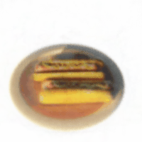
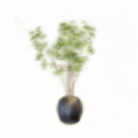
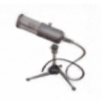
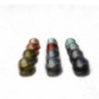
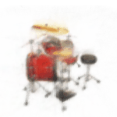

# Radiance-Fields

NPM3D project: implementation of [Plenoxels](https://github.com/sxyu/svox2) from (almost) scratch. 

## Training
Run `main.py` to start the training on a [NeRF dataset](https://drive.google.com/drive/folders/128yBriW1IG_3NJ5Rp7APSTZsJqdJdfc1) of your choice. It takes approximately 30 minutes and saves the final 128x128x128 voxel grid in `./saved_grids`.

