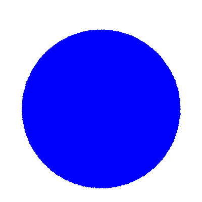
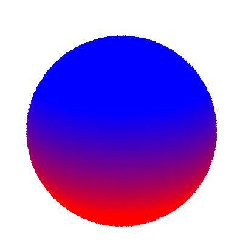
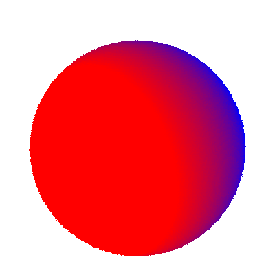
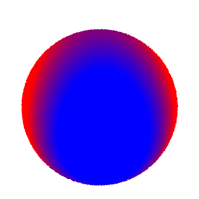
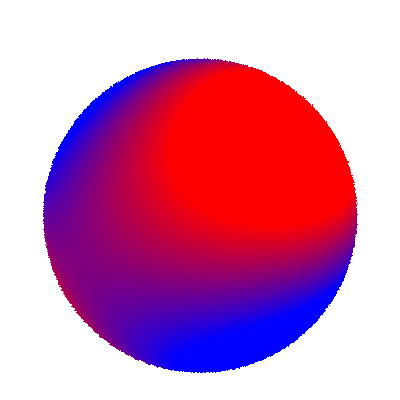
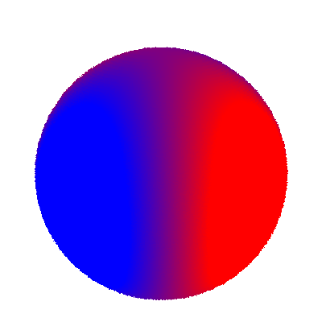
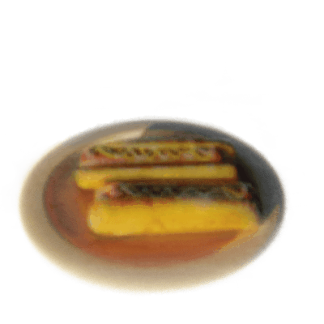

# Radiance-Fields

NPM3D MVA project, coded from (almost) scratch, inspired by [Space carving](https://www.cs.toronto.edu/~kyros/pubs/00.ijcv.carve.pdf) and [Plenoxels](https://github.com/sxyu/svox2). Requires the [NeRF dataset](https://drive.google.com/drive/folders/128yBriW1IG_3NJ5Rp7APSTZsJqdJdfc1).

## Space carving, plenoxels and spherical harmonics

Composed of two steps: space carving and opaque voxels optimization. Running `main_carve_sph.py` takes approximately 4 minutes on a single GPU.

  

  

Spherical harmonics of degree 9 are used to render the shading of each voxel:

       

## Space carving and point cloud extraction

Running `main_carve.py` takes approximately 1 minute on a single GPU.

    

## Our implementation of plenoxels

  

   

### Training
Run `main.py` to start the training. It takes approximately 30 minutes on a single GPU and saves the final 128x128x128 voxel grid in `./saved_grids/`.

